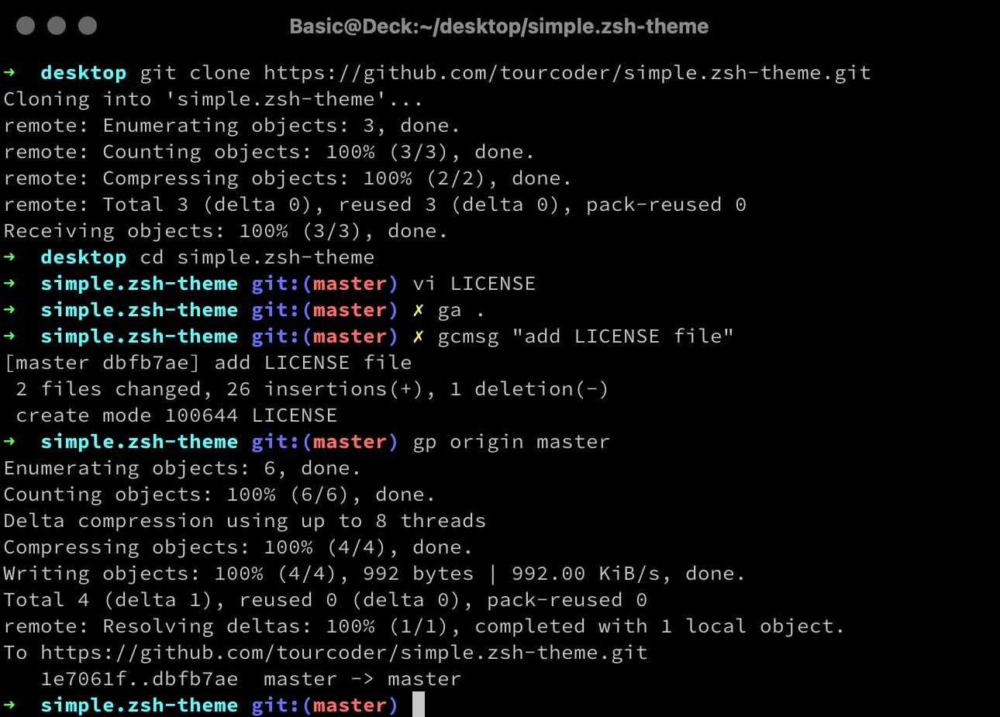

# simple.zsh-theme
My ohmyzsh theme

#### Steps to use

- Enter folder 

  ```
  cd ~/.oh-my-zsh/themes
  ```

- Create a file, and its name ends with `.zsh-theme`, e.g.

  ```
  vi simple.zsh-theme
  ```
  
- Place the follow in this file

  ```
  # simple.zsh-theme

  if [ $UID -eq 0 ]; then NCOLOR="red"; else NCOLOR="green"; fi
  local return_code="%(?..%{$fg[red]%}%? ↵%{$reset_color%})"

  # primary prompt
  PROMPT='$FG[237]------------------------------------------------------------%{$reset_color%}
  $FG[032]%~\
  $(git_prompt_info) \
  $FG[105]%(!.#.»)%{$reset_color%} '
  PROMPT2='%{$fg[red]%}\ %{$reset_color%}'
  RPS1='${return_code}'
  # color vars
  eval my_gray='$FG[237]'
  eval my_orange='$FG[214]'

  # git settings
  ZSH_THEME_GIT_PROMPT_PREFIX="$FG[075]($FG[078]"
  ZSH_THEME_GIT_PROMPT_CLEAN=""
  ZSH_THEME_GIT_PROMPT_DIRTY="$my_orange*%{$reset_color%}"
  ZSH_THEME_GIT_PROMPT_SUFFIX="$FG[075])%{$reset_color%}"
  ```
  
- Run command `vi ~/.zshrc`, change the `ZSH_THEME` to `ZSH_THEME="simple"`

#### Font

- Font Family: `Source Code Pro`

- Font Size: 13

### Screenshot



#### License

[MIT](LICENSE)
